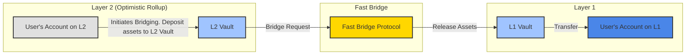
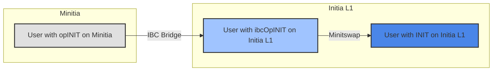
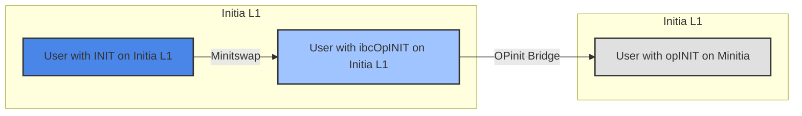

## Background

### Optimistic Bridges

In conventional [optimistic rollups](https://ethereum.org/en/developers/docs/scaling/optimistic-rollups/) systems such as Ethereum and Optimism or Arbitrum, asset transfers from the Layer 1 to rollups are mainly done through an optimistic bridge. These bridges allow for instant asset transfers from the L1 to the rollup, but enforces a waiting period (typically 7 days) on bridge transactions back to the Layer 1.

And while this waiting period is necessary to allow time for the validity of the transaction to be verified, and potentially challenged and for [fraud proofs](https://academy.binance.com/en/glossary/fraud-proof) to be submitted, users having to wait for 7 days to get their assets back is  suboptimal from a user experience perspective.

### Fast Bridges

To solve this problem, there have been various attempts at implementing "fast bridges". These protocols builds on top of the native native optimistic bridges to allow for instant asset transfers both from the L2 to L1.

Most fast bridges are implemented as liquidity pools or vaults between the base asset on the L1 and the bridged asset on the rollup, with most falling into one of two designs:

1. **single vault for each chain**: One central liquidity pool on each chain (L1 and L2) for a given asset. When a user wants to bridge assets from L2 to L1, they deposit into the L2 vault, and an equivalent amount is released from the L1 vault to the user.
2. **vault for each L1:L2 pair**: Dedicated vault for each asset pair between L1 and L2. For example, for our example of Optimism and Arbitrum, there would be separate vaults for each L1:Optimism and L1:Arbitrum pair.

When users bridge assets from L2 to the L1 using bridges, the protocol under the hood deposits their bridged assets into the bridge's liquidity pool on the rollup, and subsequently transfers an equivalent amount of the asset from the liquidity pool on the Layer 1 to the user's address on the L1. And while this design has proven effective so far, it does have some drawbacks, with the main one being liquidity fragmentation.

In both designs, the primary asset (e.g., ETH) must be distributed across multiple liquidity pools on various networks. This results in inefficient liquidity utilization, reduced pool depth, less favorable swap prices, increased slippage, and an overall suboptimal user experience.

To solve this problem for Initia and the various Minitia, we have created the Minitswap DEX..

## Minitswap

When designing Minitswap, we had 3 main goals:

1. Minimize and potentially solve the liquidity fragmentation problem of current fast bridges
2. Zero waiting period for asset transfers between L1 and L2 in either direction

with the overall objective of generally providing users with the best bridging experience throughout the ecosystem.

### Liquidity Fragmentation

To solve the liquidity fragmentation problem of current fast bridges, Minitswap utilizes a single INIT liquidity pool on the Initia L1 for all bridging transactions to all Minitia rollups. From this single INIT liquidity pool, multiple virtual pools are then created between INIT and the opINIT (Initia's native token on the rollup) for each rollup. This design prevents interested liquidity providers from having to provide INIT liquidity separately for each rollup and for all of the liquidity to be concentrated in a single pool.

### Zero Waiting Period

To facilitate zero waiting period for asset transfers between L1 and L2, Minitswap utilizes a two step process for bridging assets on Minitia to Initia L1 and vice versa, utilizing a combination of IBC and the OPinit Bridge.

For Minitia → Initia L1 transfers, the process looks as follows:

1. Users with opINIT on a Minitia bridge to the Initia L1 via IBC
2. Once the bridge transaction succeeds, they will have ibcOpINIT on Initia L1
3. Then they swap their ibcOpINIT for INIT on Minitswap
4. Once the swap succeeds, they will have INIT on Initia L1

And as IBC transfers are near instant, this process allows for near instant transfers of INIT from Minitia to Initia L1.

For Initia L1 → Minitia transfers, OPinit Bridge already offers a zero waiting period for INIT transfers to Minitia.

However, in some cases, user bridging in this direction through Minitswap might actually get an exchange rate better than 1:1, depending on the current pool prices. If they were to do so, the follow would look as follows:

1. Users with INIT on Initia L1 swap their INIT for ibcOpINIT on Minitswap
2. Then they bridge the ibcOpINIT from Initia L1 to the Minitia via the OPinit Bridge
3. Once the bridge transaction succeeds, they will have opINIT on the Minitia

Again, as L1 → L2 transfers using optimistic bridges, including OPinit Bridge, Initia L1 → Minitia transfers are also always near instant regardless of which route users take.

Thus, by utilizing a combination of IBC and the OPinit Bridge, Minitswap allows for near instant transfers of INIT between Initia L1 and Minitia in both directions.

#### Why Not Use IBC Only?

While [IBC](https://tutorials.cosmos.network/academy/3-ibc/1-what-is-ibc.html), which is natively built into all Minitias, provides a fast, secure, and reliable protocol for transferring assets between different Layer 1 (L1) blockchains, it is not designed and does not have the necessary guarantees in place for transferring assets between L1 and single-sequencer rollups such as Minitias. This is because of two main reasons:

- **Lack of Challenge Period and Fraud Proof Mechanism**: If IBC were used as the main bridge, malicious Minitia operators could exploit the bridge's near-instant transfers by modifying the state to steal or mint fraudulent assets. They could then bridge these assets to the Initia L1 and instantly further to other chains or exchanges. Since IBC does not enforce a challenge period or fraud proof mechanism, there would be no way to prevent or reverse this.
- **No Forced Withdrawal Mechanism**: Bridging tokens through IBC always involves submitting a transaction to the source chain. Malicious Minitia sequencers could censor and prevent the transfer by simply not including it in the Minitia's blocks. Since IBC does not have a [forced withdrawal](https://docs.superbridge.app/optimism/forced-withdrawals) mechanism specific to rollups, users with assets on such Minitias would not be able to withdraw their assets.