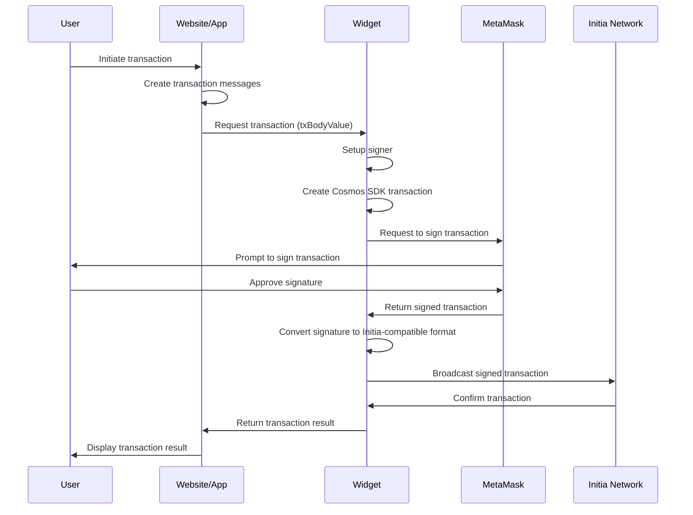

When designing the user experience for Initia, one of the main key areas of discussion is around how users uses and interacts with their wallets and apps. How do we still offer a native, smooth experience for users, while still ensuring that existing blockchain users don't need to add yet another wallet to their already bloated collection.

## The Problem With Wallets

You see, blockchain wallets have a problem. Their original purpose is twofold:

1. be a place to store and manage your accounts and keys
2. be an interface for users to use their keys to interact with the blockchain

However, as the the wallet landscape and blockchain ecosystem has grown, these same wallets have started to become a bottleneck and a friction point. Similar to how the blockchains themselves have gotten fragmented, so have the surrounding tools including wallets.

n practice, this fragmentation happens both within and across ecosystems. However, for this article, we'll focus on the fragmentation that occurs when crossing ecosystems.

### Exploring Fragmentation

**We as an industry has normalized the idea of having a new wallet for each new ecosystem or tech stack.** And while there are certainly good reasons for this, such as offering a tailored experience for users or adding and supporting specific niche features, a major part is also self-imposed limitations. See, wallets have gone from simply being key management tools to full-fledged applications on its own, with feature offerings such as:

- direct transaction broadcasting through the wallet
- asset and portfolio management
- on-chain functionalities such as swaps, staking, and more

Again this is not necessarily bad! But all of these features differs among chains. How you send transactions and queries user balances differs significantly between say EVM, Solana, and Cosmos, not to mention more niche chains. In some cases, the user flows for each also differs. Supporting these features for all ecosystems in a single wallet then becomes an undetaking of brobdingnagian proportions, if at all feasible. Thus, when interacting across chains, users need to choose and further switch between numerous wallet options:

- **EVM**: MetaMask, Rabby, Uniswap, etc.
- **Cosmos**: Keplr, Cosmostation, Leap, etc.
- **Solana**: Phantom, Backpack, Solflare etc.


Your previously universal private keys are now restricted, imposed, and locked down by its container. For an EVM user wanting to interact with Cosmos with the same key needs to find and install a new wallet, set up their mnemonic, and switch between the two frequently.

This obviously results in a suboptimal UX. But further than that, the need for multiple wallets also increases the potential risks for the user. They need to worry about using the correct wallet extension link, inputting the private key correctly and securely, and more. All this needs to change. And, with Initia, we have the chance to do just that.

When building the wallet experience for Initia, our thesis is simple; **"keys, not wallets."** In short:

1. treat wallets as what they originally meant to be, as signing devices
2. make wallets universal again.

To achieve this, we've designed the [Initia Wallet Widget](https://github.com/initia-labs/wallet).

## Initia Wallet Widget

### Goals and Features

At its core, key functions of the Wallet Widget are simple:

1. Act as an intermediary between a dApp and the user's wallet, allowing users and apps to utilize existing wallets
2. Offload all the conventional functionality and complexity of signing and broadcasting transactions from the wallet to the Widget

Instead of having wallets directly interact with a dApp, the Wallet Widget acts as an intermediary layer between them. Instead of each app having to implement and support every major wallet and perform the necessary conversion for different wallets, VMs, signatures, and transaction types, all of this is abstracted away and handled by the Widget. The application can then solely focus on what's most important: building out core functionalities and experiences for the user, with the rest handled for them.

On the user side, the Wallet Widget allows users to interact with all applications on Initia with the wallet that they already have. No going to the Chrome Store and installing a new wallet, no security risks of having to re-import private keys, no cluttered and overloaded browser sidebars. **The same wallet you already have, but for an entirely new ecosystem of apps.** Let's explore how this works in more detail.

### Painting a Picture

Let's say you're a user with an existing wallet wanting to interact with [Initia App](https://app.testnet.initia.xyz).

When you first click on "Connect Wallet", you'll see a modal prompting you to choose which wallet you want to connect with.


For this example, let's assume you want to use Rabby. You'd select Rabby Wallet from the options, and...that's it. You're connected! On the backend, the Widget is retrieving the necessary account information from the Rabby Wallet (e.g. address, public key, etc.) and creating the necessary states for it. During this, the Widget also uses your hex (0x...) address to derive your `init`-prefixed bech32 address.

Now that you're connected, let's see how interacting with the app and broadcasting transaction works. Say you want to stake 1 INIT to a validator. And for the sake of simplicity, let's say you've already funded your address with some tokens.

You'd go to the "*Stake*" page, select "*INIT*" as the token, enter "*1*" as the amount, choose your validator, and click "*Confirm*" and "*Approve*" on the modal. At this point, you'll see a Rabby pop-up with the transaction.


But if you look closely, you might notice notice two things:

- **the wallet is asking you to only sign a message**, not actually broadcast the transaction
- **you've never actually added the Initia network** or switched to it on your wallet

### The Secret Sauce

How is this possible? Again, the Widget is using the connected wallet solely as a signing device, and offloading the job of actually broadcasting the transaction from the wallet to itself. And since the private key you're using to sign the message is the same across all chains, the network the wallet is connected to doesn't matter. The Widget then handles all the necessary tasks of:

- creating the transaction payload
- converting the signature received from the wallet to the appropriate formats
- broadcasting the final transaction to the network
- polling the transaction status and returning the results to the application

## Technical Implementation

Let's now look at how the Widget is actually implemented to handle this. The complete process is as follows:



### Transaction Request

When the user initiates an action on the application, the app sends the requested user actions (implemented as messages) to the Wallet Widget by calling the [`requestTx`](https://github.com/initia-labs/wallet/blob/develop/widget/src/actions/tx.ts#L58) function. In the function call, the app passes in the main transaction payload (`txBodyValue`) and other options like chain ID and gas configurations.

```ts
export async function requestTx(txBodyValue: TxBodyValue, options: RequestTxOptions = {}): Promise<string> {
  const { chainId = LayerManager.defaultChainId, gas: fixedGas } = options

  const { signer, layer, wallet } = await setupSigner(txBodyValue, chainId)
  const gas = fixedGas || (await estimateGas(txBodyValue, signer, chainId))

  const walletName = wallet.name
  const isWebView = walletName === WalletNames.InitiaWebView

  if (!aminoConverters && !useWalletAsSignerOnly && signer instanceof InitiaSigner) {
    const registry = createRegistry(protoTypes)
    await signer.wallet.requestAddInitiaLayer(layer)
    const transactionHash = await signer.wallet.signAndBroadcastSync(chainId, registry.encodeTxBody(txBodyValue), gas)
    await signer.pollTx(transactionHash)
    return transactionHash
  }

  return new Promise((resolve, reject) => {
    opened$.next({
      component: "RequestTx",
      requested: {
        layer,
        txBodyValue,
        gas,
        gasAdjustment: fixedGas ? 1 : gasAdjustment,
        skipPollingTx: isWebView,
        resolve: (transactionHash: string) => {
          if (isWebView) {
            window.initiaWebView?.emit?.("txConfirmed", transactionHash)
          }

          resolve(transactionHash)
          close()
        },
        reject: async (e: Error) => {
          const error = await fetchFriendlyError(e, { prefixUrl: errorsUrl, chainId })

          if (isWebView) {
            window.initiaWebView?.emit?.("txFailed", error)
          }

          reject(error)
          close()
        },
      },
    })
  })
}
```

### Signer Setup

The Widget then calls the [`setupSigner`](https://github.com/initia-labs/wallet/blob/develop/widget/src/actions/tx.ts#L14) function, which:

- Validates the transaction data body using `TxBodyValueSchema`
- Ensures the specified chain is added to the `LayerManager`
- Verifies that a wallet is connected and a signer is authenticated

```ts
async function setupSigner(
  txBodyValue: TxBodyValue,
  chainId: string,
): Promise<{ signer: BaseSigner; layer: Chain; wallet: WidgetWallet }> {
  if (!TxBodyValueSchema.safeParse(txBodyValue).success) {
    throw new Error("Tx is invalid")
  }

  LayerManager.addLayer(chainId)

  const layer = LayerManager.findLayer(chainId)
  if (!layer) throw new Error("Layer not found")

  const wallet = wallet$.value
  if (!wallet) throw new Error("No wallet")

  const signer = await getSigner(wallet, layer)
  await signer.connect()
  if (!signer) throw new Error("No signer")

  return { signer, layer, wallet }
}
```

### Transaction Handling

Once the signer is set up, the Widget proceeds to prepare, sign, and broadcast the transaction. This process is managed by the [`signAndBroadcastTx`](https://github.com/initia-labs/wallet/blob/develop/widget/src/signers/base/BaseSigner.ts#L105) function:

```ts
async signAndBroadcastTx(txBodyValue: TxBodyValue, fee: StdFee, mode: "sync" | "block" = "block"): Promise<string> {
  const tx = await this.signTx(txBodyValue, fee)
  const transactionHash = await this.broadcastTx(tx)
  if (mode === "sync") return transactionHash
  await this.pollTx(transactionHash)
  return transactionHash
}
```

This function orchestrates four main steps:

#### Transaction Signing

The [`signTx`](https://github.com/initia-labs/wallet/blob/develop/widget/src/signers/base/BaseSigner.ts#L62) function creates the Cosmos SDK transaction data and forwards it to the wallet for user signing.

```ts
const tx = await this.signTx(txBodyValue, fee)
```

The `signTx` function is defined as follows:

```ts
async signTx({ messages, memo = "" }: TxBodyValue, fee: StdFee): Promise<TxRaw> {
  const signingClient = await this.getSigningClient()
  const { registry } = signingClient
  const aminoMessages = messages.map((msg) => this.aminoTypes.toAmino(msg))
  const { address, pubkey } = await this.getAccount()
  const account = await signingClient.getAccount(address)
  if (!account) throw new Error("Account not found")
  const { accountNumber, sequence } = account
  const signDoc = makeSignDoc(aminoMessages, fee, this.chain.chain_id, memo, accountNumber, sequence)

  assertDefined(this.offlineSigner)
  const { signature } = await this.offlineSigner.signAmino(address, signDoc)

  const signedBody = TxBody.fromPartial({
    messages: messages.map((msg) => registry.encodeAsAny(msg)),
    memo: memo,
  })

  const signedAuthInfo = AuthInfo.fromPartial({
    signerInfos: [
      {
        publicKey: encodePubkey(encodeSecp256k1Pubkey(pubkey)),
        modeInfo: { single: { mode: SignMode.SIGN_MODE_EIP_191 } },
        sequence: BigInt(sequence),
      },
    ],
    fee: {
      amount: [...fee.amount],
      gasLimit: BigInt(fee.gas),
      granter: fee.granter,
      payer: fee.payer,
    },
  })

  const tx = TxRaw.fromPartial({
    bodyBytes: TxBody.encode(signedBody).finish(),
    authInfoBytes: AuthInfo.encode(signedAuthInfo).finish(),
    signatures: [fromBase64(signature.signature)],
  })

  return tx
}
```

Within `signTx`, the Widget:

- Prepares the account and necessary transaction fields
- Creates a `signDoc` object representing the raw Cosmos SDK transaction data
- Passes the `signDoc` to [`offlineSigner.signAmino`](https://github.com/initia-labs/wallet/blob/develop/widget/src/signers/ethereum/EthereumOfflineSigner.ts#L43) for signing

```ts
async signAmino(signerAddress: string, signDoc: StdSignDoc): Promise<AminoSignResponse> {
  const address = await this.fetchAddress()

  if (address !== signerAddress) {
    throw new Error("Signer address does not match the provided address")
  }

  const signature = await this.sign(signDoc)

  return { signed: signDoc, signature }
}
```

The actual signing occurs in the [`sign`](https://github.com/initia-labs/wallet/blob/develop/widget/src/signers/ethereum/EthereumOfflineSigner.ts#L21) function

```ts
private async sign(signDoc: StdSignDoc): Promise<StdSignature> {
  const compressedPublicKey = await this.utils.fetchPublicKey()
  const signDocAminoJSON = sortedJsonStringify(signDoc)
  const signatureHex = await this.utils.personalSign(signDocAminoJSON) // prompts user to sign message

  // to be covered in c.
  // const signatureFromHex = fromHex(signatureHex.replace("0x", "")).subarray(0, -1)
  // const secp256signature = Secp256k1Signature.fromFixedLength(signatureFromHex)
  // const signatureBytes = secp256signature.toFixedLength()
  // return encodeSecp256k1Signature(compressedPublicKey, signatureBytes)
}
```

#### User Interaction

The user is prompted to sign the message using their wallet (e.g., Rabby Wallet) in the [`personalSign`](https://github.com/initia-labs/wallet/blob/develop/widget/src/signers/ethereum/EthereumUtils.ts#L22) function:

```ts
async personalSign(message: string | Uint8Array): Promise<string> {
  try {
    if (isAdditionalWallet(this.provider)) {
      return await this.provider.signMessage(message)
    }

    const provider = new ethers.BrowserProvider(this.provider)
    const signer = await provider.getSigner()
    return await signer.signMessage(message)
  } catch (error) {
    if (isError(error, "ACTION_REJECTED")) throw new Error(error.shortMessage)
    throw error
  }
}
```

#### Signature Conversion

Since the default signature format of EVM wallets is different from what the Cosmos SDK expects, the Widget needs to convert the signature received from the wallet to the format expected by the Cosmos SDK before broadcasting it to the network. The process is similar for non-EVM wallets, but with slightly different implementations.

```ts
private async sign(signDoc: StdSignDoc): Promise<StdSignature> {
  // covered in a.
  // const compressedPublicKey = await this.utils.fetchPublicKey()
  // const signDocAminoJSON = sortedJsonStringify(signDoc)
  // const signatureHex = await this.utils.personalSign(signDocAminoJSON) // prompts user to sign message

  
  const signatureFromHex = fromHex(signatureHex.replace("0x", "")).subarray(0, -1)
  const secp256signature = Secp256k1Signature.fromFixedLength(signatureFromHex)
  const signatureBytes = secp256signature.toFixedLength()
  return encodeSecp256k1Signature(compressedPublicKey, signatureBytes)
}
```

#### Transaction Broadcasting

After obtaining the signature and modifying it to be Cosmos SDK compatible, the Widget finally broadcasts the transaction to the network using the [`broadcastTx`](https://github.com/initia-labs/wallet/blob/develop/widget/src/signers/base/BaseSigner.ts#L68) function:

```ts
async broadcastTx(txRaw: TxRaw): Promise<string> {
  const signingClient = await this.getSigningClient()
  return await signingClient.broadcastTxSync(TxRaw.encode(txRaw).finish())
}
```

### Transaction Confirmation
  
Once the transaction is broadcasted and eventually included in a block, the Widget returns the transaction results to the application.

By relying only on the signing functionality of the wallet, and offloading the transaction payload building, signing, and broadcasting to the Widget, we've enabled any existing wallet to be used for interacting with all apps on Initia.

## Onboarding New Users

But what about users that don't have any wallets yet? To serve those users, we come up with two solutions:

- Initia Wallet
- Social Login

For on-chain users, we've designed the Initia Wallet to offer the best and native experience when interacting with chains within the Initia ecosystem. For users that don't want to use wallets at all, the social login feature allows them to simply sign-in to Google Account, and a new wallet is automatically created for them. We will explore both of these options in more detail in future articles.
