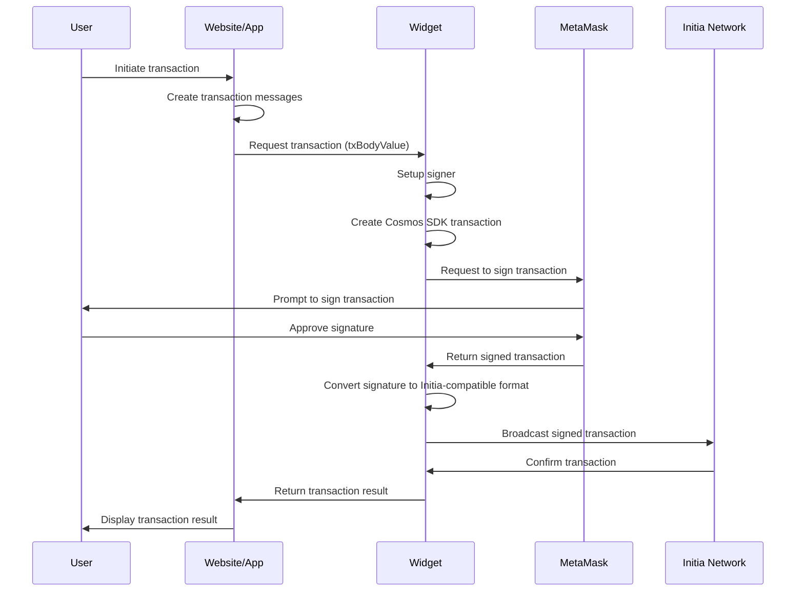
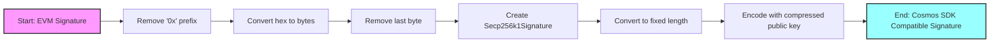

When designing the user experience for Initia, one of the key areas of discussion is how users use and interact with their wallets and apps. How do we offer a native, smooth experience for users while ensuring that existing blockchain users don't need to add yet another wallet to their already bloated collection? This article explores our solution: the Initia Wallet Widget.

## The Problem With Wallets

You see, blockchain wallets have a problem. Their original purpose is twofold:

1. be a place to store and manage your accounts and keys
2. be an interface for users to use their keys to interact with the blockchain

However, as the wallet landscape and blockchain ecosystem have grown, these same wallets have started to become a bottleneck and a friction point. Similar to how the blockchains themselves have fragmented, so have the surrounding tools, including wallets.

In practice, this fragmentation occurs both within and across ecosystems. However, this article will focus on the fragmentation that occurs when crossing ecosystems.

### Exploring Fragmentation

**We as an industry have normalized the idea of having a new wallet for each new ecosystem or tech stack.** While there are undoubtedly good reasons for this, such as offering a tailored user experience or adding and supporting specific niche features, a significant part is also self-imposed limitations. See, wallets have gone from simply being key management tools to full-fledged applications on their own, with feature offerings such as:

- direct transaction broadcasting through the wallet
- asset and portfolio management
- on-chain functionalities such as swaps, staking, and more

Again this is not necessarily bad! But all of these features differs among chains. How you send transactions and queries user balances differs significantly between say EVM, Solana, and Cosmos, not to mention more niche chains. In some cases, the user flows for each also differs. Supporting these features for all ecosystems in a single wallet becomes an undetaking of brobdingnagian proportions, if feasible. Thus, when interacting across chains, users need to choose and further switch between numerous wallet options:

- **EVM**: MetaMask, Rabby, Uniswap, etc.
- **Cosmos**: Keplr, Cosmostation, Leap, etc.
- **Solana**: Phantom, Backpack, Solflare etc.


Your previously universal private keys are now restricted, imposed, and locked down by its container. An EVM user wanting to interact with Cosmos with the same key must find and install a new wallet, set up their mnemonic, and switch between the two frequently.

This results in a suboptimal UX. But further than that, the need for multiple wallets also increases the potential risks for the user. They need to worry about using the correct wallet extension link, inputting the private key correctly and securely, and more. All this needs to change. And, with Initia, we have the chance to do just that.

When building the wallet experience for Initia, our approach is simple; **"keys, not wallets."** In short:

1. **wallets as key managers**: treat wallets as what they originally meant to be, as signing devices
2. **make wallets universal (again)**: allow users to use their existing wallets to interact with Initia

To achieve this, we've designed the [Initia Wallet Widget](https://github.com/initia-labs/wallet).

## Initia Wallet Widget

### Goals and Features

At its core, the key functions of the Wallet Widget are simple:

1. Act as an intermediary between a dApp and the user's wallet, allowing users and apps to utilize existing wallets
2. Offload all the conventional functionality and complexity of signing and broadcasting transactions from the wallet to the Widget

This approach offers several benefits:

- Simplifies dApp development by abstracting wallet interactions
- Provides a consistent user experience across different wallets
- Enhances security by reducing the need for users to manage multiple wallets

Instead of having wallets directly interact with a dApp, the Wallet Widget acts as an intermediary layer between them. This means each app doesn't have to implement and support every major wallet or perform the necessary conversion for different wallets, VMs, signatures, and transaction types. All of this is abstracted away and handled by the Widget. The application can then solely focus on what's most important: building out core functionalities and experiences for the user, with the rest handled for them.

On the user side, the Wallet Widget allows users to interact with all applications on Initia with the wallet that they already have. No going to the Chrome Store and installing a new wallet, no security risks of re-importing private keys, no cluttered and overloaded browser sidebars. **The same wallet you already have, but for an entirely new ecosystem of apps.** Let's explore how this works in more detail.

### Painting a Picture

Let's say you're a user with an existing wallet who wants to interact with the [Initia App](https://app.testnet.initia.xyzt).

When you first click on "Connect Wallet," a modal window prompts you to choose which wallet you want to connect with.


For this example, let's assume you want to use Rabby. You'd select Rabby Wallet from the options, and...that's it. You're connected! On the backend, the Widget retrieves the necessary account information from the Rabby Wallet (e.g., address, public key, etc.) and creates the states required for it. During this, the Widget also uses your hex (0x...) address to derive your `init`-prefixed bech32 address.

Now that you're connected, let's see how interacting with the app and broadcasting transactions work. Say you want to stake 1 INIT to a validator. For the sake of simplicity, let's say you've already funded your address with some tokens.

You'd go to the "*Stake*" page, select "*INIT*" as the token, enter "*1*" as the amount, choose your validator, and click "*Confirm*" and "*Approve*" on the modal. At this point, you'll see a Rabby pop-up with the transaction.


But if you look closely, you might notice notice two things:

- **the wallet is asking you to only sign a message**, not actually broadcast the transaction
- **you've never actually added the Initia network** or switched to it on your wallet

How is this possible?

### The Secret Sauce

As mentioned before, the Widget is using the connected wallet solely as a signing device. It is offloading the function of broadcasting the transaction from the wallet to itself. And since the private key you're using to sign the message is the same across all chains, the network the wallet is connected to doesn't matter.

The Widget handles all the tasks necessary to make that possible. But what are these tasks?

## Digging Deeper

To accomplish its feat, the Widget performs multiple steps, as illustrated in the following sequence diagram:



For those looking for a TL;DR, the Widget:

- receives the transaction data from the application
- passes the transaction data to the connected wallet for signing
- converts the EVM signature to the Cosmos SDK compatible format
- broadcasts the transaction to the network
- returns the transaction results to the application

But for others, let's break down each step in more detail. For the sake of example, let's say you're trying to send 1 INIT to another address on Initia.

### 1. Transaction Request

When a user initiates the token transfer transaction on an application, the app sends the necessary transaction details to the Widget using the [`requestTx`](https://github.com/initia-labs/wallet/blob/develop/widget/src/actions/tx.ts#L58) function. This includes the transaction payload and other options like chain ID and gas configurations.

### 2. Signer Setup

Inside `requestTx`, the Widget first sets up the signer by validating the transaction data and ensuring the specified chain is added. It also verifies that a wallet is connected and an authenticated signer account is available.

This signer class is extremely important. It defines the specific logic of how to sign transactions for each wallet type, and is the main way in which the Widget accomplishes the remaining step. For this example, we wil be using the [EthereumSigner](https://github.com/initia-labs/wallet/blob/develop/widget/src/signers/ethereum/EthereumSigner.ts#L15) variant, meant for EVM wallets.

### 3. Transaction Handling

Once the signer is set up, the Widget prepares, signs, and broadcasts the user's transaction.

This step begins with the Widget preparing the transaction data and sending it to the connected wallet for user approval. The [`signTx`](https://github.com/initia-labs/wallet/blob/develop/widget/src/signers/base/BaseSigner.ts#L62) function inside the signer we just created handles this by creating a `signDoc` object that represents the raw Cosmos SDK transaction data.

```ts
async signTx({ messages, memo = "" }: TxBodyValue, fee: StdFee): Promise<TxRaw> {
  //...
 const aminoMessages = messages.map((msg) => this.aminoTypes.toAmino(msg))
 const { address, pubkey } = await this.getAccount()
 const account = await signingClient.getAccount(address)
  if (!account) throw new Error("Account not found")
 const { accountNumber, sequence } = account
 const signDoc = makeSignDoc(aminoMessages, fee, this.chain.chain_id, memo, accountNumber, sequence)

  assertDefined(this.offlineSigner)
 const { signature } = await this.offlineSigner.signAmino(address, signDoc)
  //...
}
```
  
In the last line of the above snippet, the `signDoc` option is passed into [`signAmino`](https://github.com/initia-labs/wallet/blob/develop/widget/src/signers/ethereum/EthereumOfflineSigner.ts#L43) for signing. This is where the magic begins. The [`personalSign`](https://github.com/initia-labs/wallet/blob/develop/widget/src/signers/ethereum/EthereumUtils.ts#L22) function inside `signAmino` contains a line that triggers the EVM wallet's `signMessage` function. When that line is reached, the Widget sends a request to the wallet to prompt the user to sign a message that contains the transaction data.

```ts
async personalSign(message: string | Uint8Array): Promise<string> {
 try {
    //...
    const provider = new ethers.BrowserProvider(this.provider)
    const signer = await provider.getSigner()
    return await signer.signMessage(message) // triggers a pop-up for user to sign message
 } catch (error) {
    if (isError(error, "ACTION_REJECTED")) throw new Error(error.shortMessage)
 throw error
  }
}
```

However, EVM signature format is incompatible with Cosmos SDK (and by extension Initia) transactions by default. So, for the Widget to be able to use the signature to build the complete transaction, the signature must first be converted. The snippet below shows the conversion process.

```ts
private async sign(signDoc: StdSignDoc): Promise<StdSignature> {
  //...
 const signatureFromHex = fromHex(signatureHex.replace("0x", "")).subarray(0, -1)
 const secp256signature = Secp256k1Signature.fromFixedLength(signatureFromHex)
 const signatureBytes = secp256signature.toFixedLength()
 return encodeSecp256k1Signature(compressedPublicKey, signatureBytes)
}
```

If we were to visualize the conversion, it would look like this:



And while this conversion process is similar across all wallet types, the specific steps vary depending on the wallet's default signature format.

### 4. Transaction Broadcasting

After the signing and signature conversion, the Widget creates the final Cosmos SDK transaction and broadcasts it to the network. The transaction object is created by combining the signature, transaction data above, and other necessary fields to create a the final `TxRaw` transaction object. That object is then finally broadcasted to the network using the [`broadcastTx`](https://github.com/initia-labs/wallet/blob/develop/widget/src/signers/base/BaseSigner.ts#L68). Once the transaction is included in a block, the Widget returns the transaction results to the application, displaying the outcome to the user.

### 5. Transaction Confirmation

Once the transaction is included in a block, the Widget returns the transaction results to the application and displays the outcome to the user.

Leveraging the Widget's capabilities enables seamless interaction with the Initia network using any compatible wallet. This approach simplifies the transaction process, making it more accessible for users across different blockchain ecosystems.

## Conclusion

From the above, it's pretty clear how the Widget solves a major pain point for users coming into Initia from other chains and ecosystems. By providing a single intermediary that handles all the wallet and network-specific logic, we've unlocked a significantly more seamless and user-friendly experience.

But the Initia Wallet Widget isn't just for users coming from other chains and ecosystems. It's also for users who don’t have any wallets yet. To serve those users, the Widget also comes with two solutions:

- Initia Wallet
- Social Login

For those open to using wallets, we’ve designed the Initia Wallet to offer the best and most native experience when interacting with chains within the Initia ecosystem. For users who don’t want to use wallets at all, the social login feature allows them to sign in to their Google Account, and a new wallet is automatically created for them. We will explore both of these options in more detail in future articles.
